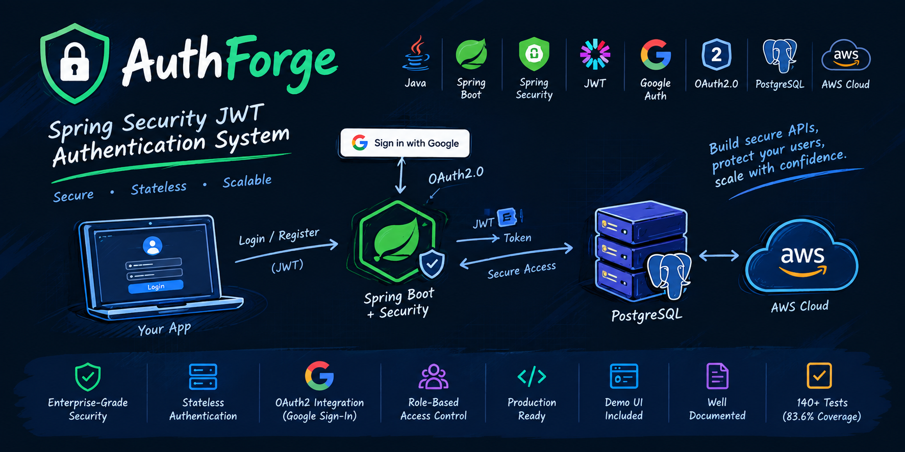
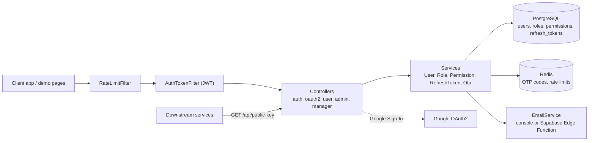
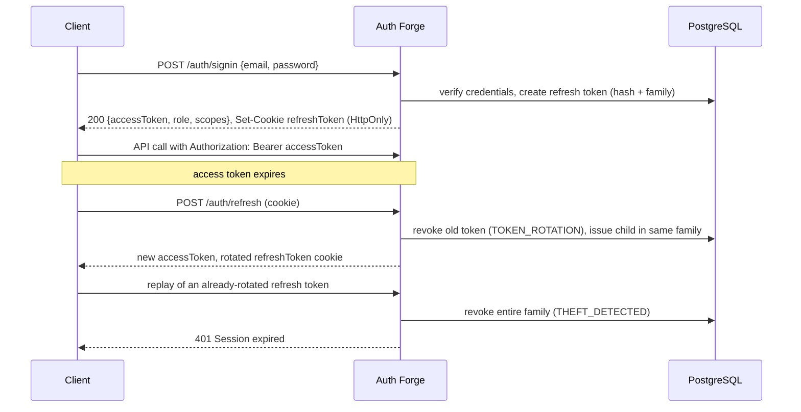
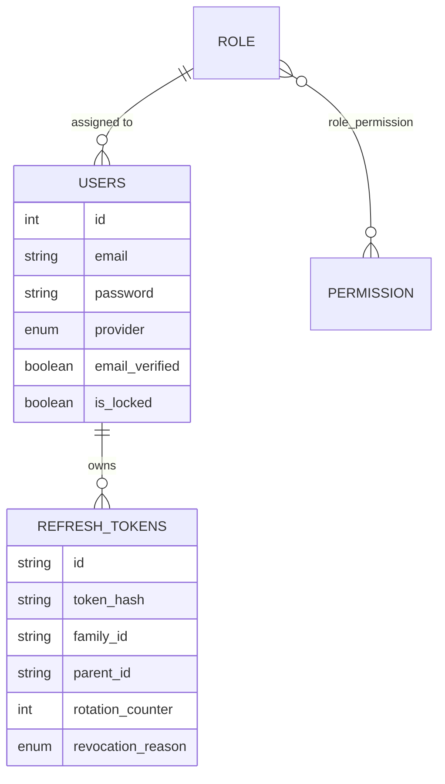

<div align="center">

  

  <h1>Auth Forge</h1>

  <p><strong>A standalone authentication and authorization server for Spring Boot: RS256 JWTs, rotating refresh tokens, Google OAuth2, email OTP verification and database-driven RBAC.</strong></p>

  <br/>

  
  
  
  
  
  
  
  

  <p>
    <a href="documentations/endpoints/ENDPOINTS.md">API Reference</a> &middot;
    <a href="documentations/DOCUMENTATION_INDEX.md">Documentation</a> &middot;
    <a href="https://github.com/yousuf-git/auth_forge_java/issues">Report a Bug</a>
  </p>

</div>

---

> Auth Forge is a self-contained identity service. Client apps send users to it to sign up, sign in (locally or with Google) and refresh sessions; downstream services verify its RS256-signed access tokens with a public key it publishes, so they never share a secret with it.

##  About

Auth Forge is a Spring Boot 3.4 / Java 21 service that owns user identity for one or more applications. It handles local email-and-password accounts with OTP email verification, Google Sign-In through Spring Security's OAuth2 client, and role-based authorization where each role carries a set of fine-grained permissions stored in PostgreSQL.

On a successful login it issues two credentials. The **access token** is a stateless JWT carrying the user's id, role and permission scopes. The **refresh token** is an opaque random value delivered in an `HttpOnly` cookie. Only its SHA-256 hash is stored, and every use rotates it. If a token that was already rotated is presented again, the whole token family is revoked as a suspected theft. Redis backs the short-lived state: OTP codes, OTP send throttling, and per-IP rate limits on the `/auth/**` endpoints.

The repository also ships HTML demo pages (login, signup, admin panel, manager panel, customer dashboard, OAuth2 demo) served from `src/main/resources/static`, so the full flow can be exercised in a browser without a separate frontend.

##  Features

- **Asymmetric JWT signing:** access tokens are signed with RS256 by default (HS256 is still supported) and carry `role`, `scopes` and `user_id` claims. The PEM public key is served at `GET /api/public-key` for external verifiers.
- **Refresh token rotation with theft detection:** tokens are 256-bit random values stored as SHA-256 hashes and grouped by family. Reusing a rotated token revokes the entire family (`THEFT_DETECTED`).
- **Revocation reasons:** each revoked token records `TOKEN_ROTATION`, `MANUAL_LOGOUT`, `MAX_DEVICES_EXCEEDED`, `THEFT_DETECTED` or `ADMIN_REVOKED`, so legitimate revocations are not mistaken for attacks.
- **Session limits and device management:** active sessions per user are capped (default 5, oldest revoked first). Users can list their sessions, revoke one, or revoke all others. Admins can list and revoke sessions for any user.
- **Email verification and password reset via OTP:** 6-digit codes are stored hashed in Redis with a TTL, a per-code attempt limit, a resend cooldown and an hourly send cap.
- **Google OAuth2 sign-in:** `redirect_uri` is checked against an allowlist, local and Google accounts are merged into a single user table, and the browser is redirected back to the client with an access token.
- **OAuth2-style token endpoints:** `POST /oauth2/token` supports the `password` and `refresh_token` grants, and `/oauth2/introspect` implements RFC 7662 introspection.
- **Database-driven RBAC:** roles and permissions are managed at runtime through the admin API and enforced with `@PreAuthorize`.
- **Rate limiting:** a Redis-backed fixed-window limiter allows 10 requests/min per IP and path on `/auth/**` and 20 requests/min on `/auth/refresh`. It fails open if Redis is unavailable.
- **Pluggable email delivery:** the `console` provider logs emails and is the default. The `supabase` provider sends through a Supabase Edge Function. Both use HTML templates for verification, reset, welcome and password-changed mail.
- **Hardened defaults:** stateless sessions, BCrypt password hashing, a CORS allowlist, HSTS (1 year, subdomains), `X-Frame-Options: DENY`, `nosniff`, and scheduled cleanup of expired and revoked tokens.

##  Tech Stack

- **Language / runtime:** Java 21
- **Framework:** Spring Boot 3.4.1 (Web, Security, Data JPA, Validation, Actuator, OAuth2 Client, OAuth2 Resource Server, Data Redis)
- **Tokens:** JJWT 0.12.6
- **Database:** PostgreSQL (runtime), H2 (tests)
- **Cache / ephemeral state:** Redis
- **API docs:** springdoc-openapi 2.8.3 (Swagger UI)
- **Config:** spring-dotenv (loads `.env`)
- **Tooling:** Maven 3.9+, Lombok, Docker (multi-stage build)

##  Architecture

Every request passes through two custom filters before reaching the controllers. `RateLimitFilter` throttles `/auth/**` by client IP, and `AuthTokenFilter` validates the `Authorization: Bearer` JWT and populates the `SecurityContext`. Method-level `@PreAuthorize` rules then gate each endpoint by role or authority.



### Login and refresh flow



### Data model



##  Project Structure

```text
.
├── src/main/java/com/learning/security/
│   ├── auth/          # JWT filter, 401/403 handlers, OAuth2 success/failure handlers, request repository
│   ├── configs/       # WebSecurityConfig, RateLimitFilter, RedisConfig, SwaggerConfig
│   ├── controllers/   # Auth, OAuth2, User, Admin, Manager, PublicKey, Greet, Test
│   ├── dtos/          # Request/response DTOs (admin/ holds admin-only payloads)
│   ├── enums/         # AuthProvider, OtpType, RevocationReason
│   ├── exceptions/    # GlobalExceptionHandler and custom exceptions
│   ├── models/        # JPA entities: User, Role, Permission, RefreshToken
│   ├── repos/         # Spring Data repositories
│   ├── scheduler/     # TokenCleanupScheduler (nightly purge)
│   ├── services/      # Business logic; email/ holds EmailService implementations
│   └── utils/         # JwtUtils, CookieUtils, OAuth2CookieUtils
├── src/main/resources/
│   ├── keys/          # RSA public key (private key is git-ignored)
│   ├── static/        # Demo HTML pages
│   └── templates/email/  # HTML email templates
├── src/test/          # JUnit 5 + Spring Security Test suites
├── documentations/    # Deep-dive guides: OAuth2, refresh tokens, endpoints, tests, admin panel
├── init.sql           # PostgreSQL schema + default roles and permissions
├── initial_data.sql   # Optional sample users (admin, manager, customer)
├── .env.example       # Environment variable template
└── Dockerfile         # Multi-stage build on eclipse-temurin 21
```

##  Getting Started

### Prerequisites

- JDK 21 and Maven 3.9+
- PostgreSQL
- Redis (optional for boot: rate limiting fails open, but OTP verification and password reset require it)
- OpenSSL, to generate the RSA key pair
- A Google OAuth2 client ID and secret, if you want Google Sign-In

### Installation

```bash
git clone https://github.com/yousuf-git/auth_forge_java.git
cd auth_forge_java
mvn clean install -DskipTests
```

### 1. Create the database schema

```bash
createdb auth_db
psql -U postgres -d auth_db -f init.sql
```

`init.sql` creates the `role`, `permission`, `role_permission`, `users` and `refresh_tokens` tables and seeds the `ROLE_ADMIN`, `ROLE_PLANT_MANAGER` and `ROLE_CUSTOMER` roles with their permissions.

### 2. Generate the RSA signing keys

The private key is git-ignored and must be created locally:

```bash
cd src/main/resources/keys
openssl genrsa -out private_key.pem 2048
openssl rsa -in private_key.pem -pubout -out public_key.pem
openssl pkcs8 -topk8 -inform PEM -outform PEM -in private_key.pem -out private_key_pkcs8.pem -nocrypt
```

See [`src/main/resources/keys/README.md`](src/main/resources/keys/README.md) for rotation and production guidance.

### 3. Configure environment

```bash
cp .env.example .env
```

`src/main/resources/application.yml` only selects the active profile (`SPRING_PROFILES_ACTIVE`, default `dev`). Profile files such as `application-dev.yml` are git-ignored, so create one next to it. The following template maps every property the code reads to the variables in `.env.example`:

<details>
<summary><code>src/main/resources/application-dev.yml</code> template</summary>

```yaml
spring:
  datasource:
    url: ${DATABASE_URL}
    username: ${DATABASE_USERNAME}
    password: ${DATABASE_PASSWORD}
  jpa:
    hibernate:
      ddl-auto: none                         # schema comes from init.sql
  data:
    redis:
      host: ${REDIS_HOST:localhost}
      port: ${REDIS_PORT:6379}
      username: ${REDIS_USERNAME:}
      password: ${REDIS_PASSWORD:}
  security:
    oauth2:
      client:
        registration:
          google:
            client-id: ${GOOGLE_CLIENT_ID}
            client-secret: ${GOOGLE_CLIENT_SECRET}

yousuf:
  app:
    name: Auth Forge
    jwtSecret: ${JWT_SECRET}                 # Base64; used only when jwtSigningAlgorithm=HS256, but must be set
    jwtExpirationTimeInMs: ${JWT_EXPIRATION_MS}
    jwtSigningAlgorithm: RS256
    rsaPrivateKeyPath: classpath:keys/private_key_pkcs8.pem
    rsaPublicKeyPath: classpath:keys/public_key.pem
    refreshTokenExpirationTimeInMs: 604800000
    maxSessionsPerUser: 5
    cookie:
      secure: false                          # set true behind HTTPS
    cors:
      allowed-origins: ${CORS_ALLOWED_ORIGINS}
    oauth2:
      authorized-redirect-uris: ${OAUTH2_AUTHORIZED_REDIRECT_URIS}
    email:
      provider: console                      # or "supabase"
      # supabase:
      #   edge-function-url: https://<project>.supabase.co/functions/v1/<function>
      #   service-role-key: <key>
    otp:
      expiry-minutes: 10
      max-attempts: 5
      cooldown-seconds: 60
      max-per-hour: 5
```

</details>

### Running

```bash
mvn spring-boot:run
```

The server listens on `http://localhost:8080`. A quick smoke test:

```bash
curl http://localhost:8080/greet
# Greetings !
```

| Page | URL |
|---|---|
| Login | http://localhost:8080/login.html |
| Signup | http://localhost:8080/signup.html |
| Customer dashboard | http://localhost:8080/customer-dashboard.html |
| Manager panel | http://localhost:8080/manager-panel.html |
| Admin panel | http://localhost:8080/admin-panel.html |
| OAuth2 demo | http://localhost:8080/oauth2-demo.html |
| Swagger UI | http://localhost:8080/swagger-ui/index.html |
| Health | http://localhost:8080/actuator/health |

##  Environment Variables

From [`.env.example`](.env.example):

| Variable | Description | Example | Required |
|---|---|---|---|
| `SPRING_PROFILES_ACTIVE` | Active Spring profile | `dev` | No |
| `DATABASE_URL` | PostgreSQL JDBC URL | `jdbc:postgresql://localhost:5432/auth_db` | Yes |
| `DATABASE_USERNAME` | Database user | `postgres` | Yes |
| `DATABASE_PASSWORD` | Database password | — | Yes |
| `JWT_SECRET` | Base64 HMAC secret (HS256 mode) | — | Yes |
| `JWT_EXPIRATION_MS` | Access token lifetime in ms | `3600000` | Yes |
| `REDIS_HOST` | Redis host | `localhost` | No |
| `REDIS_PORT` | Redis port | `6379` | No |
| `REDIS_USERNAME` | Redis ACL user | — | No |
| `REDIS_PASSWORD` | Redis password | — | No |
| `GOOGLE_CLIENT_ID` | Google OAuth2 client ID | — | For Google Sign-In |
| `GOOGLE_CLIENT_SECRET` | Google OAuth2 client secret | — | For Google Sign-In |
| `CORS_ALLOWED_ORIGINS` | Comma-separated allowed origins | `http://localhost:3000,http://localhost:8080` | No |
| `OAUTH2_AUTHORIZED_REDIRECT_URIS` | Comma-separated allowlist for OAuth2 `redirect_uri` | `http://localhost:3000/oauth2/redirect` | Yes |

##  API Reference

Interactive docs are available in Swagger UI at `/swagger-ui/index.html`. See [ENDPOINTS.md](documentations/endpoints/ENDPOINTS.md) for request and response examples.

| Method | Endpoint | Access | Description |
|---|---|---|---|
| `POST` | `/auth/signup` | Public | Register a local account and send a verification OTP |
| `POST` | `/auth/verify-email` | Public | Verify email with OTP |
| `POST` | `/auth/resend-otp` | Public | Resend a verification or reset OTP |
| `POST` | `/auth/signin` | Public | Log in; returns access token and sets the refresh cookie |
| `POST` | `/auth/refresh` | Cookie | Rotate the refresh token and issue a new access token |
| `POST` | `/auth/logout` | Cookie | Revoke the current session |
| `POST` | `/auth/logout-all` | Cookie | Revoke every session for the user |
| `POST` | `/auth/forgot-password` | Public | Send a password-reset OTP |
| `POST` | `/auth/reset-password` | Public | Reset the password with an OTP |
| `GET` | `/oauth2/authorize/google?redirect_uri=...` | Public | Start Google Sign-In |
| `POST` | `/oauth2/token` | Public | `grant_type=password` or `refresh_token` |
| `POST` / `GET` | `/oauth2/introspect` | Public | RFC 7662 token introspection |
| `GET` | `/oauth2/user` | Bearer | Current OAuth2 user |
| `GET` | `/api/public-key`, `/api/public-key/info` | Public | RSA public key (PEM) and metadata |

<details>
<summary>User, manager and admin endpoints</summary>

| Method | Endpoint | Access | Description |
|---|---|---|---|
| `GET` | `/api/user/profile` | Authenticated | Current user profile |
| `GET` | `/api/user/sessions` | Authenticated | List own active sessions |
| `DELETE` | `/api/user/sessions/{sessionId}` | Authenticated | Revoke one own session |
| `DELETE` | `/api/user/sessions/other` | Authenticated | Revoke all other own sessions |
| `POST` | `/api/user/change-password` | Authenticated | Change password |
| `GET` | `/api/manager/customers` | `ROLE_PLANT_MANAGER`, `ROLE_ADMIN` | List customers |
| `PUT` | `/api/manager/reset-password/{userId}` | `ROLE_PLANT_MANAGER`, `ROLE_ADMIN` | Reset a customer's password |
| `GET` `POST` | `/api/admin/users` | `ROLE_SUPER_ADMIN` | List / create users |
| `GET` `PUT` `DELETE` | `/api/admin/users/{id}` | `ROLE_SUPER_ADMIN` | Read / update / delete a user |
| `GET` `POST` | `/api/admin/roles` | `ROLE_SUPER_ADMIN` | List / create roles |
| `GET` `PUT` `DELETE` | `/api/admin/roles/{id}` | `ROLE_SUPER_ADMIN` | Read / update / delete a role |
| `GET` `POST` | `/api/admin/permissions` | `ROLE_SUPER_ADMIN` | List / create permissions |
| `GET` `DELETE` | `/api/admin/permissions/{id}` | `ROLE_SUPER_ADMIN` | Read / delete a permission |
| `GET` | `/api/admin/sessions`, `/api/admin/sessions/stats` | `ROLE_SUPER_ADMIN` | All sessions and statistics |
| `GET` `DELETE` | `/api/admin/users/{userId}/sessions` | `ROLE_SUPER_ADMIN` | A user's sessions / revoke them all |
| `DELETE` | `/api/admin/sessions/{sessionId}` | `ROLE_SUPER_ADMIN` | Revoke a specific session |

</details>

### Verifying tokens from another service

```bash
curl http://localhost:8080/api/public-key > auth_forge_public.pem
```

Load the PEM as an RSA public key and verify incoming JWTs with RS256. The token's `role` claim holds the role name (for example `ROLE_CUSTOMER`) and `scopes` holds its permissions as a space-separated string.

##  Testing

Tests use JUnit 5, Spring Security Test and an in-memory H2 database. `src/test/resources/application.yml` activates the `test` profile, and the profile file itself (`application-test.yml`) is git-ignored. Create one with an H2 datasource and the same `yousuf.app.*` keys as the dev template before running the suite.

```bash
mvn test                             # full suite
mvn test -Dtest=AuthControllerTest    # single class
```

Suites cover the JWT filter, `JwtUtils`, `AuthController`, role-protected test endpoints, the `User`/`Role` entities, repositories and `UserDetails` services. See [TEST_DOCUMENTATION.md](documentations/tests/TEST_DOCUMENTATION.md) for details.

##  Deployment

The multi-stage `Dockerfile` builds the WAR with Maven on Temurin 21, runs it as a non-root user on `eclipse-temurin:21-jre-alpine`, and health-checks `/actuator/health`.

```bash
docker build -t auth-forge .
docker run -p 8080:8080 \
  -e SPRING_PROFILES_ACTIVE=prod \
  -e DATABASE_URL="jdbc:postgresql://host.docker.internal:5432/auth_db" \
  -e DATABASE_USERNAME="<username>" \
  -e DATABASE_PASSWORD="<password>" \
  -e JWT_SECRET="<base64-secret>" \
  -e JWT_EXPIRATION_MS="300000" \
  -e OAUTH2_AUTHORIZED_REDIRECT_URIS="https://app.example.com/oauth2/redirect" \
  auth-forge
```

The image must contain a matching `application-<profile>.yml` and the RSA key files, or `rsaPrivateKeyPath` / `rsaPublicKeyPath` must point to mounted paths. In production, set `yousuf.app.cookie.secure=true`, serve over HTTPS, and keep the private key in a secrets manager.

##  Further Reading

- [OAuth2 setup](documentations/oauth/OAUTH2_SETUP.md), [architecture](documentations/oauth/OAUTH2_ARCHITECTURE.md) and [complete flow](documentations/oauth/OAUTH2_COMPLETE_FLOW.md)
- [Refresh token implementation](documentations/refresh_token/REFRESH_TOKEN_IMPLEMENTATION.md) and [revocation reasons](documentations/refresh_token/REVOCATION_REASON_IMPLEMENTATION.md)
- [Admin panel setup](documentations/admin_panel/ADMIN_PANEL_SETUP.md)

##  Contributing

1. Fork the repository and create a branch: `git checkout -b feature/<name>`
2. Make your change and run `mvn test`
3. Commit, push, and open a pull request against `main`

##  License

MIT — see [LICENSE](LICENSE).

---

<div align="center">

  Built by <a href="https://github.com/yousuf-git">M. Yousuf</a> &middot; <a href="https://yousuf-dev.com">yousuf-dev.com</a>

</div>
